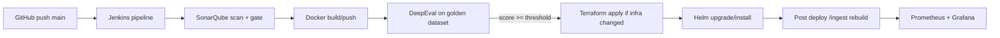

# Auto-RAG Pipeline

Production-grade starter for automating Retrieval-Augmented Generation (RAG) in CI/CD with hard quality gates.

## What this repository does

- Treats RAG artifacts as code: app code, prompts, docs, embeddings behavior, and golden Q&A dataset.
- Rebuilds/updates index from `docs/` through `/ingest`.
- Evaluates RAG quality in CI using DeepEval metrics.
- Blocks deployment when hallucination-risk quality gates fail.

## Stack

- **Source**: GitHub
- **Container**: Docker
- **CI/CD**: Jenkins + Shared Library (`ragPipeline`)
- **Deploy**: Kubernetes + Helm
- **IaC**: Terraform
- **Code quality gate**: SonarQube
- **Observability**: Prometheus + Grafana
- **RAG**: FastAPI + LangChain + ChromaDB

## Architecture



## Pipeline quality gate

Default threshold: `RAG_SCORE_THRESHOLD=0.75`

Fail build if either condition is false:

- average `Faithfulness >= 0.75`
- average composite RAG score `>= 0.75`

## Local quickstart (minikube first)

1. Build image:
	- `docker build -f rag-app/Dockerfile -t auto-rag:dev rag-app`
2. Run API locally:
	- `uvicorn app.main:app --app-dir rag-app --host 0.0.0.0 --port 8000`
3. Ingest docs:
	- `POST /ingest` with `{"paths":["./docs"],"rebuild":true}`
4. Query:
	- `POST /query` with `{"question":"..."}`

## Jenkins Shared Library plug-and-play for new repos

Any new RAG repo can reuse this automation by:

1. Adding this shared library as `rag-shared-lib` in Jenkins Global Libraries.
2. Creating a `Jenkinsfile` that calls `ragPipeline.evaluateAndDeployRAG(...)`.
3. Providing minimum expected files:
	- `docs/`
	- `rag-app/golden_dataset.json` (20–50 Q&A)
	- `rag-app/tests/test_rag.py`
4. Setting credentials:
	- registry credentials
	- cluster/kube credentials
	- `OPENAI_API_KEY` (or equivalent)

### Example library call

```groovy
ragPipeline.evaluateAndDeployRAG(
  imageRepo: 'ghcr.io/acme/auto-rag',
  imageTag: env.BUILD_ID,
  appDir: 'rag-app',
  threshold: '0.75',
  tfDir: 'infra/terraform',
  releaseName: 'auto-rag',
  chartPath: 'helm/rag-chart',
  namespace: 'rag'
)
```

## Notes for week-1 to week-4 experiment

- Start with minikube + local registry.
- Keep golden dataset small but realistic (20–50).
- Track trend of faithfulness and latency build-over-build.
- Increase threshold gradually (for example from `0.75` to `0.82`) once stable.
