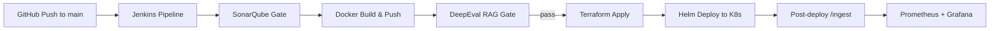

# Architecture

```mermaid
flowchart LR
	A[GitHub Push to main] --> B[Jenkins Pipeline]
	B --> C[SonarQube Gate]
	C --> D[Docker Build & Push]
	D --> E[DeepEval RAG Gate]
	E -->|pass| F[Terraform Apply]
	F --> G[Helm Deploy to K8s]
	G --> H[Post-deploy /ingest]
	H --> I[Prometheus + Grafana]
```

RAG assets (code, prompts, docs, embeddings, golden dataset) are treated as code and validated in CI before deployment.

